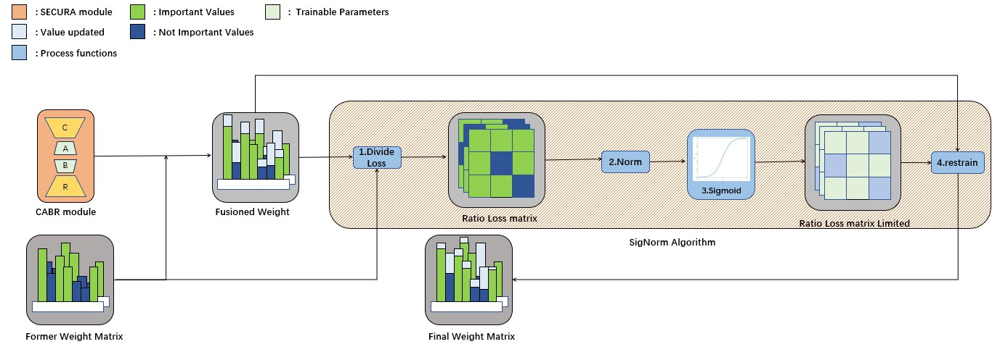

# SECURA: Sigmoid-Enhanced CUR Decomposition with Uninterrupted Retention and Low-Rank Adaptation in Large Language Models  

  

## Overview  
This repository contains the experimental setup and evaluation framework for **SECURA (CABR + SigNorm)**, a novel approach to LoRA fine-tuning that improves gradient stability and mitigates catastrophic forgetting.  

SECURA integrates **CABR** with **SigNorm**, ensuring more stable parameter updates and a better optimization landscape. Our experiments demonstrate that SECURA outperforms traditional LoRA and CABR methods in terms of gradient smoothness and knowledge retention.  

---

## Experiment Guidelines  

### **Important Notice**  
In our earlier experiments, **"SECURA"** was referred to as **CABR-LoRA**. To maintain consistency, we use the following notation in our codebase:  

- `Traintype: "CABR-LoRA"` → **M1 SECURA (CABR + SigNorm)**  
- `Traintype: "CABR-LoRA_L"` → **M2 merge method**  
- `Traintype: "CABR-LoRA_Only"` → **CABR-LoRA without SigNorm**  

---

## About the Experiment  
As mentioned in our paper, most of our datasets are available on **BBM** and **Hugging Face**, so we will not upload them here.  

Our experiments are divided into five main parts:  

- **EXP0/AddingTestSVDAnalysis** → **SVD Norm Analysis**  
- **EXP2** → **Performance Comparison of LoRA Variants**  
- **EXP3** → **Gradient-Based Experiment**  
- **EXP4** → **Knowledge Retention at 1e-3 under Different LoRA Variants**  
- **EXP5** → **Continuous Training with Different Knowledge Retention Methods**  

### **Experiment Setup**  
To set up and run the experiments, follow these steps:  

1. Clone the repository and install dependencies:  
   ```bash
   git clone https://github.com/MeCuping/SECURA.git
   cd SECURA  
   pip install -r requirements.txt  

2. Modify src/Processer to set the appropriate experimental parameters.
Adjust the vocab_size parameter in to_one_hot based on your dataset.

3. Run the experiment with the selected Traintype, by using ExpStart.py

